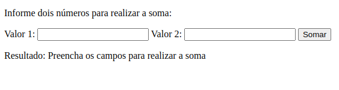

# README: Exception Handling



## Project Description

This is a small test where I validate the inputs before calling the sum function. The idea is to check if the input is empty or if it does not contain numeric values.

### Technologies

- LINUX
- VSCODE
- HTML
- JAVASCRIPT

### What I Learned

- How to use conditionals to validate an input
- How to use a function to change inner HTML 

## How to Run the Project

1. Clone the repository:

   ```bash
   git clone https://github.com/feduarte-dev/exception-handling
   ```

2. Navigate to the project directory:

   ```bash
   cd your-repository
   ```

3. Install dependencies:

   ```bash
   npm install
   ```

4. Run application:

   ```bash
   Right click index.html and open it with live server
   ```

## Contributions

[Felipe](https://www.linkedin.com/in/feduarte-dev/) - index.html - script.js


[Trybe](https://www.betrybe.com/) - Everything else
